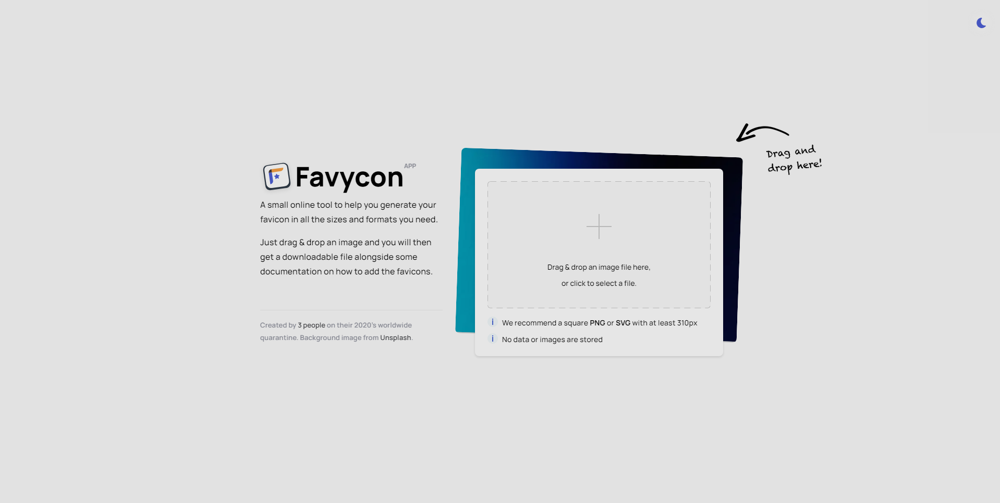
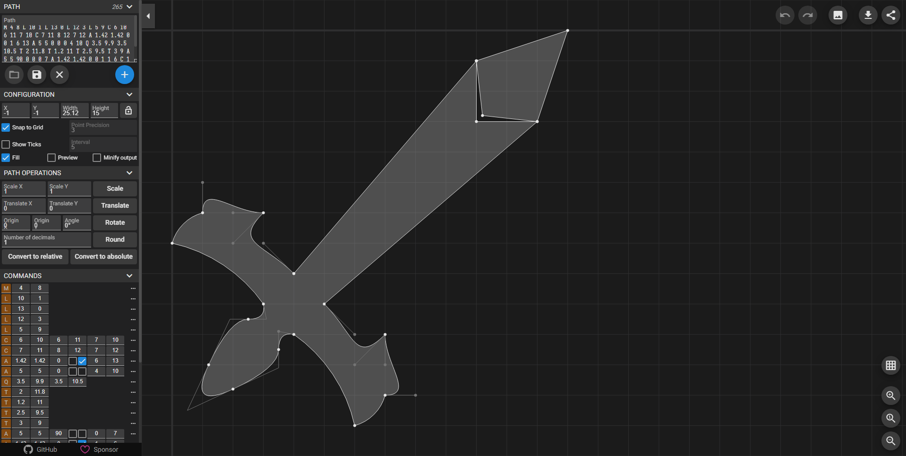

sts|repo|gp|install|start|preview
---|---|---|---|---|---
|[excalith-start-page](https://github.com/excalith/excalith-start-page)|web|`yarn` edit `./src/startpape.config.js` `yarn build --port 8010` `pnpm add next react react-dom` `npx next build` `npx next start`|`pm2 start deploy.json --name excalith-start-page --watch`|
|[mangarepack](https://github.com/Aeroblast/MangaRepack)|epub|`npm i` `npm run build`|`serve -s dist`|
|[epub-manga-creator](https://github.com/wing-kai/epub-manga-creator)|epub|`npm install` `npm audit fix --force` edit `package.json` line 21, `"homepage": "",` `npm run build`|`serve -s build`|
|[react-epub-reader](https://github.com/alex1504/react-epub-reader)|epub|`yarn` `yarn build`|`serve -s dist`|
|[excalibur](https://github.com/camelot-dev/excalibur)|pdf|`pip install excalibur-py` `pip install -r requirements-dev.txt`|`excalibur webserver`|tbd
|[doctr](https://github.com/mindee/doctr)|pdf|`https://github.com/tschoonj/GTK-for-Windows-Runtime-Environment-Installer/releases` `pip install -r demo/pt-requirements.txt` `pip install numpy --upgrade` set `USE_TORCH=1` PATH|`streamlit run demo/app.py`|
|[localpdfmerger](https://github.com/julianfbeck/localpdfmerger)|pdf|`yarn` `yarn add next react react-dom`|`yarn dev`|
|[pdf-duplex-scan](https://github.com/clemensheithecker/pdf-duplex-scan)||`npm i` `npm audit fix --force`|`npm run dev`|
|[lookscanned](https://github.com/rwv/lookscanned.io)|pdf|`npm i` `npm run build:all`|`serve -s dist`|
|[pdf-margins](https://github.com/ToyVo/pdf-margins)|pdf|`npm i` `npm run build`|`serve -s build`|
|[pdfme-playground](https://github.com/pdfme/pdfme-playground)|pdf|`npm install`|`npm run start`|
|[thinreports-basic-editor](https://github.com/thinreports/thinreports-basic-editor)|pdf||`./app/index.html`|
|[albumapp-django](https://github.com/jobsta/albumapp-django)|pdf|`python3 -m venv env` `env\Scripts\activate.bat` `pip install django reportbro-lib` `python manage.py makemigrations albums` `python manage.py migrate` `python manage.py compilemessages`|`python manage.py runserver` `open http://127.0.0.1:8000/albums`|
|[reportbro-designer](https://github.com/jobsta/reportbro-designer)|pdf|`npm install` `npm run build`|`./demos/*.html`|
|[favycon](https://github.com/ruisaraiva19/favycon)|ico|`yarn install`|`yarn dev`|
|[hot-chain-svg](https://github.com/w1nt3r-eth/hot-chain-svg)|svg|`yarn`|`yarn start`|
|[svgomg](https://github.com/jakearchibald/svgomg)|svg|`npm install` `npm run build`|`serve ./build`|
|[svgedit](https://github.com/SVG-Edit/svgedit)|svg|`npm i``npm run build --workspace @svgedit/svgcanvas``npm run build`|`serve ./dist/editor`|
|[svg-path-editor](https://github.com/Yqnn/svg-path-editor)|svg|`npm i`|`npm run build` `serve -s dist/svg-path-editor -l 3000`|
|[vtracer-webapp](https://github.com/visioncortex/vtracer)|svg|install [wasm-pack](https://rustwasm.github.io/wasm-pack) `cd webapp/app` `npm i` `wasm-pack build`|`npm run start -- --port 8000`|
|[svg2png-wasm](https://github.com/ssssota/svg2png-wasm)|png|`cd site` `pnpm install`|`pnpm dev`|tbd
|[js-image-carver](https://github.com/trekhleb/js-image-carver)|img|`yarn`|`yarn build` `yarn global add serve` edit `package.json`, `"homepage": "serve -s build -l 3995"` |
|[sketch-to-lineart](https://github.com/seleb/sketch-to-lineart)|img|`npm i`|`npm run build` `serve -s docs`|
|[ordered-dither-maker](https://github.com/seleb/ordered-dither-maker)|img|`npm i`|`npm start`|
|[visionmagic](https://github.com/visioncortex/visionmagic)|img|`cd webapp/app` `npm i` `wasm-pack build`|`npm run start -- --port 3000`|
|[image-editor](https://github.com/andrepv/image-editor)|img|`npm i` `npm audit fix --force`|`npm run build` `serve -s build -l 3001`|
|[streamlit-image-crop](https://github.com/mitsuse/streamlit-image-crop)|img|`pip install streamlit` `rm ./poetry.lock` `poetry update` `python(39) install  ` `cd streamlit_image_crop/frontend` `npm i`|`serve -s build -l 3001` and `streamlit run example.py`|
|[tikzcd-editor](https://github.com/yishn/tikzcd-editor)|diag|`npm i`|`npx prettier --write .` `npm run dist` `./dist/tikzcd-editor-v.../.index.html`||
|[figmex](https://github.com/nbw/figmex)|diag|`scoop install erlang elixir` add `.../elixir/bin` to PATH `mix deps.get` `mix setup``mix phx.server`|tbd
|[asciiflow](https://github.com/lewish/asciiflow)|diag|`scoop install bazel bazel-buildtools` `choco install bazelisk` `yarn global add @bazel/bazelisk @bazel/ibazel` or `pnpm add -g @bazel\bazelisk`  `yarn add @bazel/typescript` `yarn` `bazel build //...`|`ibazel run client:devserver`|tbd
|[drawflow](https://github.com/jerosoler/Drawflow)|diag|`npm run build`|`./docs/index.html`|
|[flowchart-fun](https://github.com/tone-row/flowchart-fun) or see [fork](https://github.com/piaverous/flowchart-fun) |diag|`yarn`|`yarn start` or open `https://vercel.com/dashboard` then import repo|
|[mermaid-live-editor](https://github.com/mermaid-js/mermaid-live-editor)|diag|install [mermaid](https://mermaid-js.github.io/mermaid) `yarn install`|`yarn dev -- --open` or `yarn build` `serve -s docs -l 3998`|
|[excalidraw](https://github.com/excalidraw/excalidraw)|diag|`yarn`|`yarn start`|
|[camelot](https://github.com/camelot-dev/camelot)|pdf|`pip install camelot` `pip install transformers datasets`||tbd
|[programmingfonts](https://github.com/braver/programmingfonts)|font|`npm i` `npm run test`|`serve -s .`|
|[my_rime](https://github.com/LibreService/my_rime)|ime|download [artifact](https://github.com/LibreService/my_rime/releases/download/latest/my-rime-dist.zip)|`serve -s my-rime-dist`|
|[kdtype](https://github.com/steveruizok/kdtype)|ime|`yarn` `yarn build`|serve -s dist`|
|[reference](https://github.com/Fechin/reference)|kbd|`npm i`|`npm run dev`|
|[cheatsheet-generator](https://github.com/nathanlesage/cheatsheet-generator)|kbd|`npm i` `cp examples/*.config.yml. config.yml` `npm run build` |`serve -s dist` or edit `./assets/template.htm`, `./layouts/layout_map.yml`|
|[markdownlint](https://github.com/DavidAnson/markdownlint)|s|`npm i` `npm run build-demo`|./demo/default.htm|tbd
|[regexr](https://github.com/gskinner/regexr)|e|`npm i`|edit `./gulpfile.babel.js` line 62, `port: 3001` `gulp`|
|[guitar-editor](https://github.com/Haixiang6123/guitar-editor)|trkr|`npm i`|`npm start`|
|[tab-editor](https://github.com/calesce/tab-editor)|trkr|`npm i`|`npm start`|
|[lrc_editor](https://github.com/yiyizym/lrc_editor)|e|`npm i`|`npm run dev`|
|[qr-designer](https://github.com/kochrt/qr-designer)|e|`npm i` `npm run generate`|`npm run start`|
|[cartographist](https://github.com/szymonkaliski/cartographist)|brower|`npm i` `npm audit fix --force`|`npm start`|
|[clcalc](https://github.com/ovk/clcalc)|calc|`npm i` edit `package.json` line 8-9, `node ./node ...` `npm run dist`|`npm run dev`|
|[notepad-calculator](https://github.com/SteveRidout/notepad-calculator)|calc||`./index.html`|
|[calcutext](https://github.com/jaredreich/calcutext)|calc|`npm i` `npm audit fix --force`|`npm run dev`|
|[notecalc3](https://github.com/bbodi/notecalc3)|calc|`scoop install rustup nodejs18` install `wasm-pack` `npm i -g serve`|`./compile_and_run.bat`|
|[anotherpomodoro](https://github.com/Hanziness/AnotherPomodoro)|clk|`yarn install` `yarn generate`|`serve output/public`|
|[woah](https://github.com/pabueco/woah)|clk|`pnpm i`|`pnpm dev`|